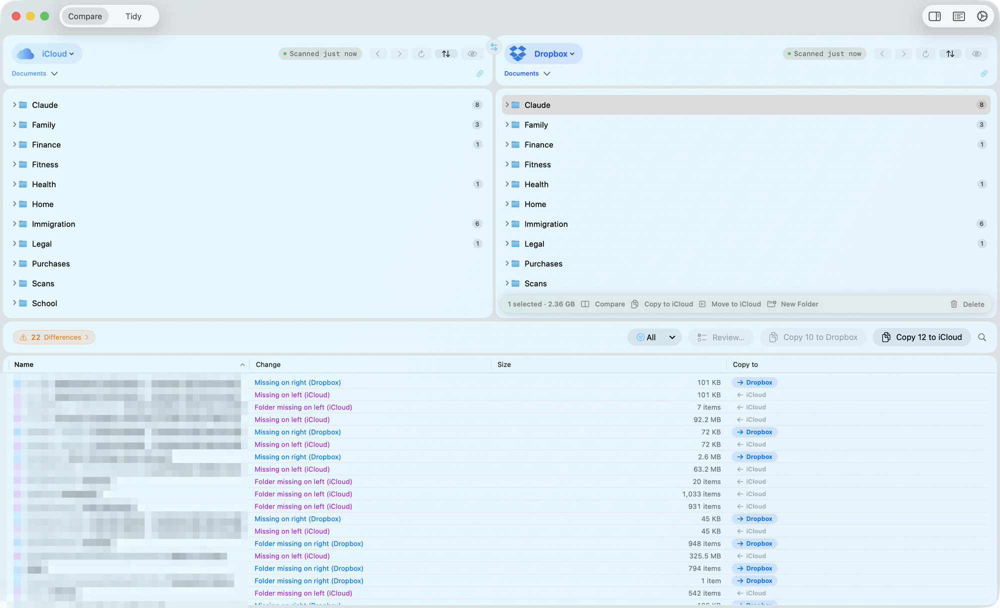
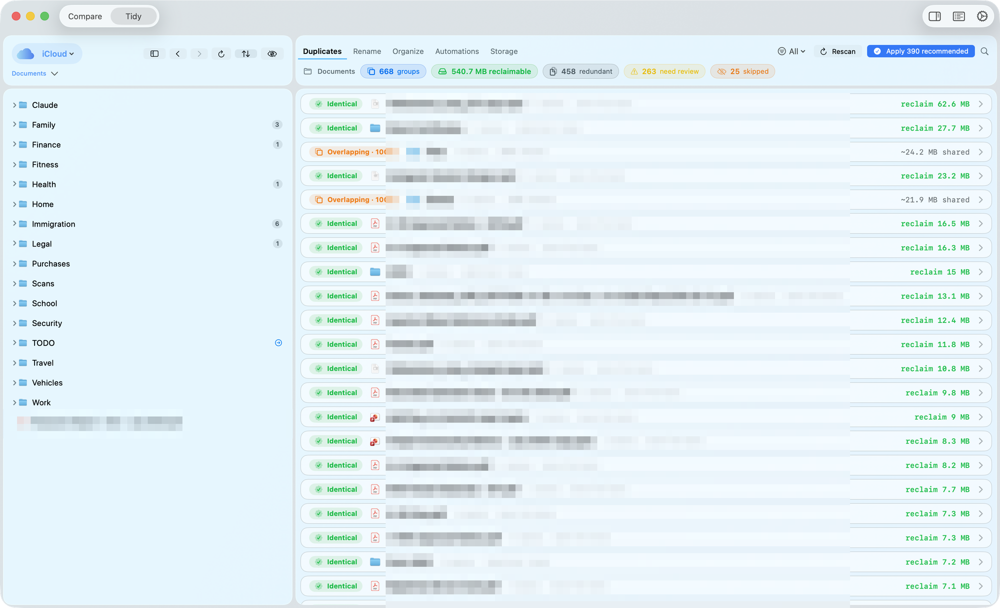
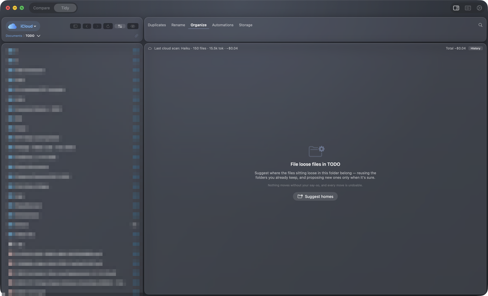
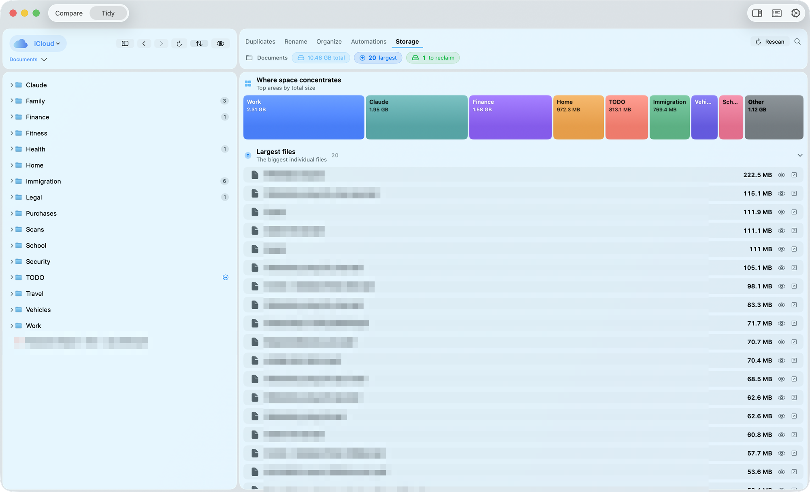
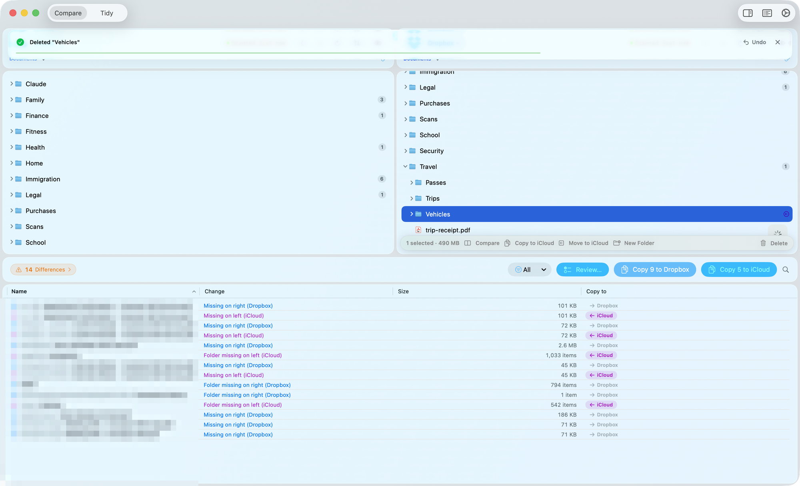
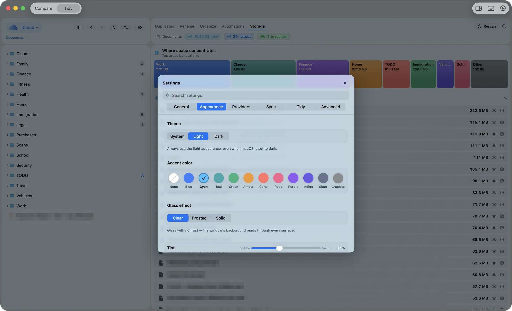

# SyncCloud

[](https://github.com/agirish/sync-cloud/actions/workflows/tests.yml)

**A native macOS app (and `git`-style CLI) for comparing, reconciling, and organizing the folders you keep across cloud providers** — iCloud Drive, OneDrive, Dropbox, and Google Drive.

🌐 **[Explore the features & screenshots →](https://agirish.github.io/sync-cloud/)**

<p align="center">
  
</p>

SyncCloud has four workspaces, and opens in **Browse** — the plain file browser: one provider's
tree, full width, nothing proposed, for the moves you make by hand. A **folder sidebar** runs down
the left of all four, holding the folders you keep, every account you have signed into, and the
folders you were last in. **Compare** puts two folders
side by side and shows exactly what differs — what's missing on each side, what's newer, what
only *looks* the same — and lets you copy, move, or reconcile items with one click. **Organize**
points a single provider at a rail of five lenses — **To File**, **Duplicates**, **Renames**,
**Restructure**, and **Rules** — that file loose documents into the right folders (optionally
with on-device Apple Intelligence or Claude), find duplicates, fix cloud-hostile filenames, and
straighten a tree that disagrees with its own habits. **Storage** is a read-only view of where
your space actually goes.

Deletes go to the Trash, overwrites are staged and swapped in atomically, and each run in the app is
a single grouped **⌘Z** for as long as that session lasts. Permanent delete exists only as a
clearly-warned fallback on volumes with no Trash; the CLI has no undo stack of its own.

---

## Highlights

### 📁 Browse — your folders, one click away
- **A folder sidebar in every workspace** (**⌃⌘S**), in three sections: **Favorites**, the folders
  and places you keep; **Locations**, every account you have signed into plus your disks and the
  Trash; and **Recents**, the folders you were last in. Favorites and Recents span every source, so
  a favorite in Dropbox is reachable without switching to Dropbox first.
- **Favorites you curate.** Starts as Desktop, Documents and Downloads; right-click any place in
  Locations to add it, any row in Favorites to remove it, or any folder in a pane to keep it.
  **Restore Standard Folders** brings the three back.
- **Drag a row to reorder** either section. Locations shares its order with the pane header's
  source dropdown, so the two can't disagree.
- **Column browsing** the way Finder does it, with an inline preview beside the stack, per-pane
  **tabs**, and a **pane bar** you arrange yourself.

### 🔍 Compare — two folders, side by side
- **Two-pane comparison** between any two providers (or plain folders), with a per-pane provider
  picker, breadcrumb navigation + back/forward history, and one-click **⇄ swap**.
- **Difference detection** by presence, modification date, and size — with a **date tolerance** that
  absorbs the timestamp rounding cloud providers do, so you don't drown in false differences.
- **Colour- and shape-coded diffs** (readable without colour): missing-on-right ▸, missing-on-left ◂,
  changed ↻, and **name conflicts** ⚠ — items that differ only by an invisible trailing space,
  trailing period, zero-width character, or Unicode form.
- **Filter and search** the differences: `All / Missing / Changed / Name conflicts` with live counts,
  plus a token search (`kind:pdf`, `>10mb`, `only:left`).
- **Guided Review** steps through each difference one at a time — Copy / Move / Skip — with a running
  tally and "Copy Remaining" to finish in bulk.
- **Content verification** checksums same-size, date-only pairs (streaming SHA-256) to tell you
  whether files *actually* differ, and offers to reconcile the ones that are byte-identical.
- **Details inspector** with name, kind, size, dates, permissions, and Quick Look.
- **Bulk or single** copy/move/delete/new-folder from the action bar, context menus, or the
  keyboard (`⌘→ / ⌘←` to copy, add `⇧` to move).

### 🗂️ Organize — put one provider in order
One rail, five lenses:
- **To File** — scans the loose files in an inbox folder and **suggests which existing folder each
  one belongs in**, filing it there safely (creating folders, never overwriting, always undoable).
- **Duplicates** — finds byte-for-byte **identical** copies, **overlapping** folders, drifted
  **versions** (`Report`, `Report (1)`, `Report-final`), **name-only** clashes, and PDFs with the
  **same text** that a byte hash misses (a provider re-stamps every download). Picks a smart
  keeper (never the one buried in `archive/old/backup`), previews each copy with Quick Look
  thumbnails, and reclaims space — always to the Trash, never trashing the last copy.
- **Renames** — filenames that break on a given provider (OneDrive's forbidden characters and
  reserved names, Dropbox's trailing spaces/periods, zero-width characters anywhere), files that
  break their folder's `NN. Mon YYYY` date convention where the folder already keeps one, and
  folders whose numbering has drifted. Each row names the problem in words and shows the name it
  would become; **Fix all** applies the provider-hostile set in one undo, and the convention and
  numbering passes are applied from their own controls.
- **Restructure** — reports where the tree disagrees with its own habits: one recurring series whose
  folders were each filed sensibly at the time and have ended up in two or more different internal
  schemes. Report-only for now: naming the disagreement is the half that cannot do any harm.
- **Rules** — deterministic, on-device rules ("when a file matches …, file it into
  `Taxes/{year}` …") with a dry-run preview. SyncCloud can also *learn* a rule after you file
  something by hand.

### 📊 Storage — see where the space goes
A read-only **treemap** of where your space actually goes — one ramp running deep to pale in your
accent hue, ordered by size, so the colour *is* the ranking — plus ranked lists of the largest
files, long-untouched files, and reclaim candidates, each row carrying a magnitude bar and its
share of the scan. Strictly read-only: it never moves, deletes, or evicts anything.

### 🤖 AI-assisted filing (optional)
Organize's suggestions start from a fast, fully-offline engine (your existing folder names + filename
signals + on-device text extraction). You can layer AI on top:
- **On-device** via Apple Intelligence (Foundation Models, macOS 26+) — nothing leaves your Mac.
- **Cloud** via **Claude** (`claude-haiku-4-5`, `claude-sonnet-5`, or `claude-opus-5`) — off by
  default, opt-in, with your API key stored in the **macOS Keychain** (never in plaintext).

Cloud usage is metered: every scan records tokens and estimated cost, guarded by a **pre-flight cost
confirmation** and hard **monthly / total budget caps** (a `$5` lifetime cap by default). Over budget,
it silently falls back to the on-device engine.

### 🧭 Setup that actually asks
A first run asks the four things SyncCloud cannot work out by looking at your folders — your name as
documents print it, which of the discovered sources you use and which is primary, who else is in the
household, and which tree to learn from — then **walks that tree and writes the folder profile**
Organize's filing, renaming and restructure passes all read. The walk reads names and counts only
(no document is opened), proposes the place names and household members it found with the folder
that vouches for each, and ticks none of them for you. **Help ▸ Set Up SyncCloud…** reopens it.

### 🛟 Safety by construction
Atomic backed-up overwrites, Trash-backed deletes, grouped reversible **Undo/Redo** (including
"Undo Last Run" from history), From:/To: transfer confirmations, collision strategies
(replace / keep-both / skip), an invalid-name pre-write guard, and a path-boundary layer that refuses
and *reports* on ambiguity rather than guessing. No single action can quietly lose data.

### 🎨 Native macOS design
A macOS 26-inspired **Liquid Glass** interface (Clear / Frosted / Solid), System / Light / Dark
themes, 12 accent hues, and per-provider brand colours. **Settings ▸ Readability** puts text size
(90–135%, on a slider with named detents) and row spacing together with five presets and a live
preview of the rows they produce.

---

## Screenshots

| Two-pane comparison | Finding duplicate copies | Filing loose files, with AI |
|---|---|---|
|  |  |  |

| Storage treemap | Undo everywhere | Settings |
|---|---|---|
|  |  |  |

More on the **[feature site](https://agirish.github.io/sync-cloud/)**.

---

## Requirements

- **macOS 26 or later** for the app — `project.yml` sets `deploymentTarget: "26.0"` and every
  `Package.swift` declares `platforms: [.macOS("26.0")]`, so an earlier system cannot run it.
- On-device AI filing additionally needs **Apple Intelligence** (it degrades gracefully without
  it). Cloud AI filing needs an Anthropic API key.
- **Xcode 26+** and **Swift 6.0+** to build — every `Package.swift` here declares
  `swift-tools-version: 6.0`, which an older toolchain cannot even parse, and the app
  target's deployment floor is macOS 26 (`dbdfe48a`), which needs the macOS 26 SDK.
  Built and tested on Xcode 26.6 / Swift 6.3.
- **[XcodeGen](https://github.com/yonaskolb/XcodeGen)** (`brew install xcodegen`) — the Xcode project
  is generated from `project.yml` and is not checked in.

## Building the app

```bash
brew install xcodegen        # once
xcodegen generate            # regenerate SyncCloud.xcodeproj from project.yml
open SyncCloud.xcodeproj      # then Build & Run (⌘R) in Xcode
```

## CLI (`synccloud`)

A `git`-style command line tool for scan/sync without opening the app. See
[`SyncCloudCLI/README.md`](SyncCloudCLI/README.md) for full docs.

```bash
cd SyncCloudCLI
swift build

# List discovered cloud providers
swift run synccloud providers

# Compare two folders (accepts a provider id/name or a path)
swift run synccloud scan  -L iCloud/Documents -R OneDrive/Documents
swift run synccloud scan  -L ~/A -R ~/B --json          # machine-readable
swift run synccloud scan  -L ~/A -R ~/B --verify        # checksum same-size pairs

# Sync (prompts unless --yes)
swift run synccloud sync  -L ~/A -R ~/B --direction to-right --strategy keep-both --yes
```

Key flags: `--direction auto|to-right|to-left`, `--strategy replace|skip|keep-both`, `--verify`,
`--fail-fast`, `--show-hidden`, `--ignore <path>`, `--json`, `--yes`. Exit codes: `0` success,
`64` usage error, `1` partial sync failure.

## Setting up cloud AI filing (optional)

1. Get an API key from the [Anthropic Console](https://console.anthropic.com/).
2. In **Settings ▸ Intelligence**, enable *Use Claude (cloud)*, paste the key (stored in the
   Keychain), pick a model, and hit **Test**.
3. Set a monthly and/or total **budget cap**. SyncCloud shows an estimated cost before each scan and
   stops at your cap.

Without a key (and without Apple Intelligence), Organize still works — it just runs the deterministic
offline engine.

## Project structure

```
SyncCloud/
├── MacApp/                     # SwiftUI app (ContentView, toolbar, app entry, filing classifiers)
├── Modules/                    # SPM packages:
│   ├── Sync/                   #   diff engine, file ops, duplicates, filing/automations, storage lens
│   ├── FileExplorer/           #   panes, differences, Organize lenses, review
│   ├── Dashboard/              #   activity log, details, breadcrumbs, sync history
│   ├── Settings/               #   settings UI + persistence
│   ├── Design/                 #   Liquid Glass design system
│   └── Events/                 #   logging, sync-history store
├── SyncCloudCLI/               # SwiftPM CLI (synccloud)
├── SyncCloudTests/             # app-target tests (hosted in SyncCloud.app)
├── docs/                       # this feature site (GitHub Pages) + engineering notes
└── project.yml                 # XcodeGen project definition
```

## Continuous integration

The seven SPM package test suites and the app-target build run on every push to `main`, `v3.x`
or `v2.x` and on every `v*` release tag, via a self-hosted GitHub Actions runner — see
[`docs/ci.md`](docs/ci.md).

## Performance notes

Findings that outlive the change that produced them are written down rather than re-derived.
[`docs/string-bridging.md`](docs/string-bridging.md) measures what `FileNode`'s lazily bridged
`id` and `name` cost across the app, and why only one of the two is worth forcing to native
storage. The benchmarks behind it are ordinary test targets gated behind an environment variable,
so neither `swift test` nor CI ever runs them; each names its variable in its own doc comment.

## Roadmap

Planned enhancements (backing up the folders that exist in only one place, saved folder-pair
presets, an in-app text diff viewer, a menu-bar status item, and more) are
tracked in [`ROADMAP.md`](ROADMAP.md). Deliberately
deferred edge cases live in [`DEFERRED_ENHANCEMENTS.md`](DEFERRED_ENHANCEMENTS.md), and internal
code that is correct but entangled enough to be worth restructuring against a major release is
catalogued in [`REFACTOR.md`](REFACTOR.md).

## License

Provided as-is for educational and personal use.
